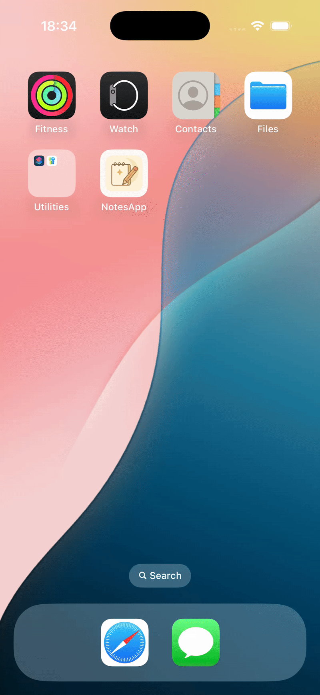

# 📝 NotesApp

A simple and elegant iOS note-taking app built with **Swift** and **Core Data**. Users can create, edit, and delete notes easily. Supports **Light/Dark Mode** toggle with a single button.

---

## 📱 Features

- 📌 Create new notes with title and content  
- 🖊 Edit existing notes  
- 🗑 Delete notes   
- 🌗 Manually toggle between Light and Dark mode  
- 💾 Notes are persisted using Core Data (offline support)  
- 🎨 Adaptive UI for Dark and Light modes
- 📅 Notes are sorted by creation date
- 🧱 Built with MVVM architecture for clean separation of concerns
  
---


## 🛠 Technologies Used

- `UIKit`  
- `Core Data`  
- `Storyboard`  
- `UITableView`, `UITextView`, `UITextField`  
- `UserDefaults` (for storing theme preference)

---

## 🚀 How to Run the Project

1. Clone the repository:

   ```bash
   git clone https://github.com/yourusername/NotesApp.git
   ```

2. Open `NotesApp.xcodeproj` in **Xcode**.

3. Build and run on a **simulator or physical device** (iOS 15+ recommended).

4. Start taking notes!

---


## 🧠 Core Data

Your notes are saved using **Core Data**, so they're still available when you close and reopen the app. No internet required. Each note includes:

- Title (`String`)
- Content (`String`)
- CreatedDate(`Date`)

---
## 🧠 MVVM Breakdown

This project is built using the **MVVM (Model-View-ViewModel)** design pattern for better code organization and maintainability.

- **Model**:  
  `Note` — Represents the data structure of a note, including properties like title, content, and creation date.

- **View**:  
  All the UI components such as the note list, note editor, and the input forms that interact with the user.

- **ViewModel**:  
  Encapsulates the logic for adding, editing, deleting, and fetching notes. It communicates with the `CoreDataManager` to persist data and exposes observable data to the views.

By separating concerns, MVVM allows the app to be **more testable**, **scalable**, and **cleanly structured**.

---


## 🖼️ Demo

<p align="center">
  
</p>

---


## ✨ Contributing

Pull requests are welcome! If you find a bug or want to improve the UI/UX, feel free to fork and contribute.

---

## 📄 License

This project is open source and available under the [MIT License](LICENSE).

---


